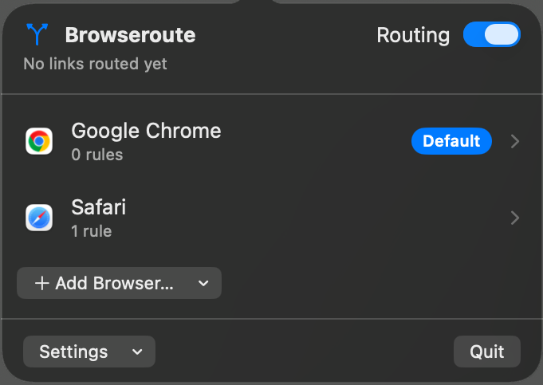

<p align="center">
  
</p>

# Browseroute

Route each `http`/`https` link to the browser you choose.

Browseroute is a macOS menu-bar app. It registers as the default web browser,
then opens every link in the matching browser: host suffix, host glob, or
host+path glob. Unmatched links go to the catch-all you mark as Default.

<p align="center">
  
</p>

## Install

macOS 14+. Builds are signed with a Developer ID certificate and notarized by
Apple, so there is no Gatekeeper prompt.

```bash
brew install --cask terrifiedbug/tap/browseroute
open /Applications/Browseroute.app
```

Or download `Browseroute-<version>.zip` from the
[latest release](https://github.com/TerrifiedBug/browseroute/releases/latest),
unzip, and move `Browseroute.app` into Applications. GitHub zip installs
check for updates from Settings. Homebrew cask installs are updated by
Homebrew.

To build from source (Swift 6.2 toolchain):

```bash
git clone https://github.com/TerrifiedBug/browseroute.git
cd browseroute
make install
open /Applications/Browseroute.app
```

Click the menu-bar icon (the branch arrow). Add your browsers, set one as the
Default catch-all, then Settings → Set as Default Browser… and accept the
system dialog.

`make install` copies the app to `/Applications/Browseroute.app`. Default-browser
registration only works from that stable path, not from a random `build/` copy.

Turn on Settings → Launch at Login so routing stays instant. Otherwise macOS
cold-starts the app on every click. The Routing switch in the popover header
pauses matching: every link then opens in the Default catch-all.

## Rules

Browsers and patterns are edited in the popover. Rules are tried top to bottom;
the first match wins. Matching is case-insensitive.

| Pattern | Matches |
|---|---|
| `example.com` | apex and subdomains (`a.example.com`). Not `evil-example.com`. |
| `*.corp.com` | host glob (`a.corp.com`). Not the apex `corp.com`. |
| `github.com/work-org` or `github.com/work-org/*` | host + path. A pattern with `/` gets an implicit trailing `*` if it does not already end in `*`. |

If nothing matches, it uses the Default catch-all. If none is set, the first
browser in the list. If the list is empty, Safari.

Outlook SafeLinks are unwrapped first, so matching uses the inner host.

If the chosen browser is missing, a notification says so. The link then opens
in the Default catch-all when that one is installed; otherwise it is not opened.

## Develop

```bash
make run      # build a debug .app and launch it in the menu bar
make check    # lint + build + test
make install  # package and copy to /Applications
```

The app is an `LSUIElement` agent, so it has no Dock icon.

## License

MIT © 2026 Danny
